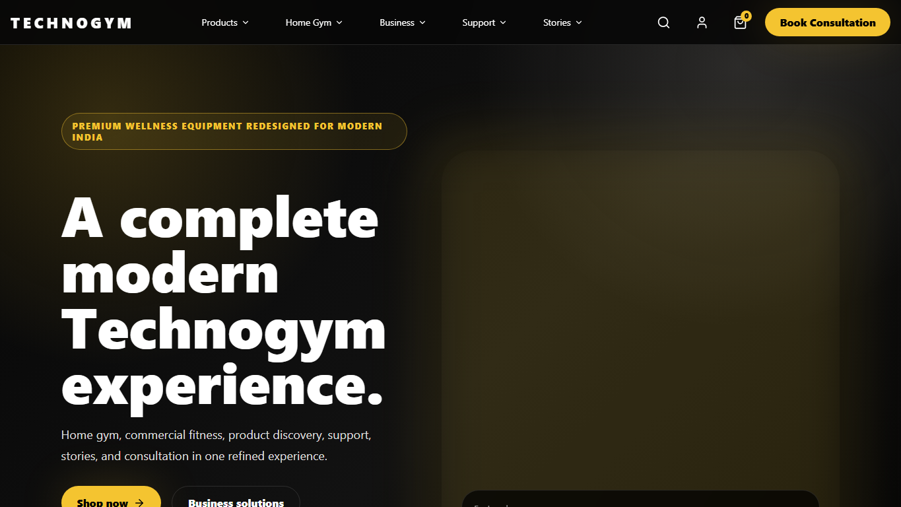
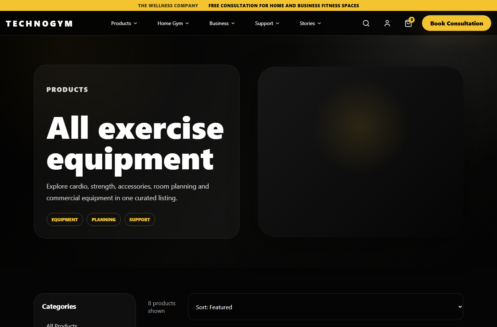
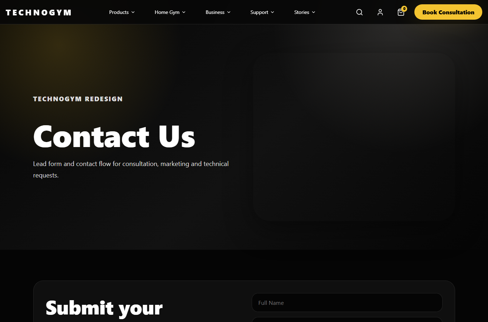
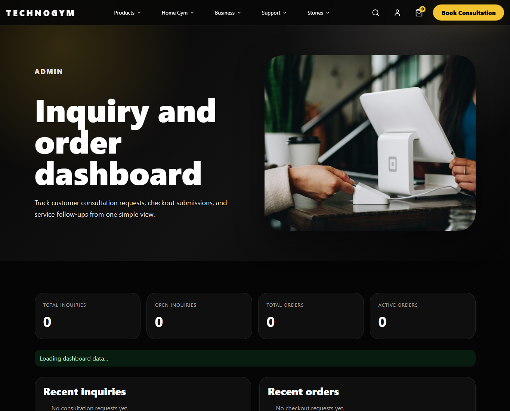
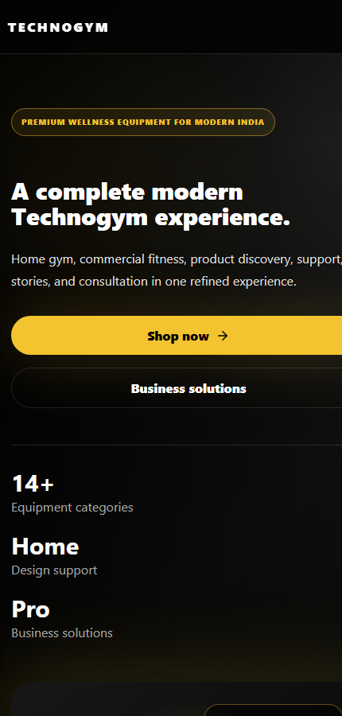

# Technogym Website Redesign

Full-stack redesign of the Technogym India website with a modern React frontend and Python FastAPI backend.

Original website: https://www.technogym.com/en-IN/

Submitted by: Rehan Raza

## Purpose

This project reimagines Technogym's shopping, consultation, product discovery, business, support, and checkout flows with a premium dark/gold interface while keeping the original fitness and wellness purpose clear.

## Tech Stack

- Frontend: React, Vite, CSS, lucide-react
- Backend: Python, FastAPI, MongoDB Atlas, SQLite fallback
- Deployment: Vercel or Netlify for frontend, Render free tier for backend

## Features

- Premium responsive homepage, category pages, product listing, product detail, support, business, stories, contact, and checkout pages
- Search overlay, mobile navigation, cart drawer, hover states, loading states, and form feedback
- Functional contact/consultation inquiry API
- Functional checkout/order request API
- Admin dashboard for inquiries and checkout requests
- Backend validation with Pydantic
- MongoDB Atlas-ready storage for catalog, navigation, pages, inquiries, and orders
- GitHub-ready `.gitignore` and deployment config files

## Frontend Setup

```bash
npm install
npm run dev
```

Frontend URL:

```text
http://localhost:5173
```

## Backend Setup

```bash
cd Backend
python -m venv venv
venv\Scripts\activate
pip install -r requirements.txt
uvicorn app.main:app --host 0.0.0.0 --port 5000 --reload
```

Backend URL:

```text
http://localhost:5000
```

Swagger API docs:

```text
http://localhost:5000/docs
```

## Environment Variables

Frontend `.env`:

```env
VITE_API_BASE_URL=http://localhost:5000/api
```

Backend `Backend/.env`:

```env
APP_NAME=Technogym FastAPI Backend
ENV=development
HOST=0.0.0.0
PORT=5000
FRONTEND_URL=http://localhost:5173
DATABASE_URL=sqlite:///./data/technogym.db
MONGODB_URI=mongodb+srv://<username>:<password>@<cluster-url>/technogym_redesign?retryWrites=true&w=majority
MONGODB_DB_NAME=technogym_redesign
```

## API Endpoints

```http
GET  /api/health
GET  /api/site
GET  /api/navigation
GET  /api/page?path=/
GET  /api/pages
GET  /api/pages/{path}
GET  /api/categories
GET  /api/categories/{slug}
GET  /api/products
GET  /api/products/{slug}
POST /api/inquiries
GET  /api/inquiries
PATCH /api/inquiries/{id}/status
POST /api/orders
GET  /api/orders
GET  /api/orders/{id}
PATCH /api/orders/{id}/status
```

## Deployment

Frontend free options:

- Vercel: import the GitHub repo, set `VITE_API_BASE_URL` to the Render backend `/api` URL, deploy.
- Netlify: import the GitHub repo, build command `npm run build`, publish directory `dist`.

Backend free option:

- Render: create a Web Service from the repo using `render.yaml`, root directory `Backend`, start command `uvicorn app.main:app --host 0.0.0.0 --port $PORT`.
- Set `FRONTEND_URL` to the deployed frontend URL.
- Set `MONGODB_URI` to the MongoDB Atlas connection string.
- Set `MONGODB_DB_NAME` to `technogym_redesign`.

Deployment links:

- Frontend: https://technogym-redesign.vercel.app
- Backend API: https://technogym-redesign-api.onrender.com/api
- Admin Dashboard: https://technogym-redesign.vercel.app/#/admin

## Screenshots

### Homepage



### Product Listing



### Contact Form



### Admin Dashboard



### Mobile View



## Future Improvements

- Role-based authentication for account, admin, and order history
- Product image management
- Email notifications for new inquiries
